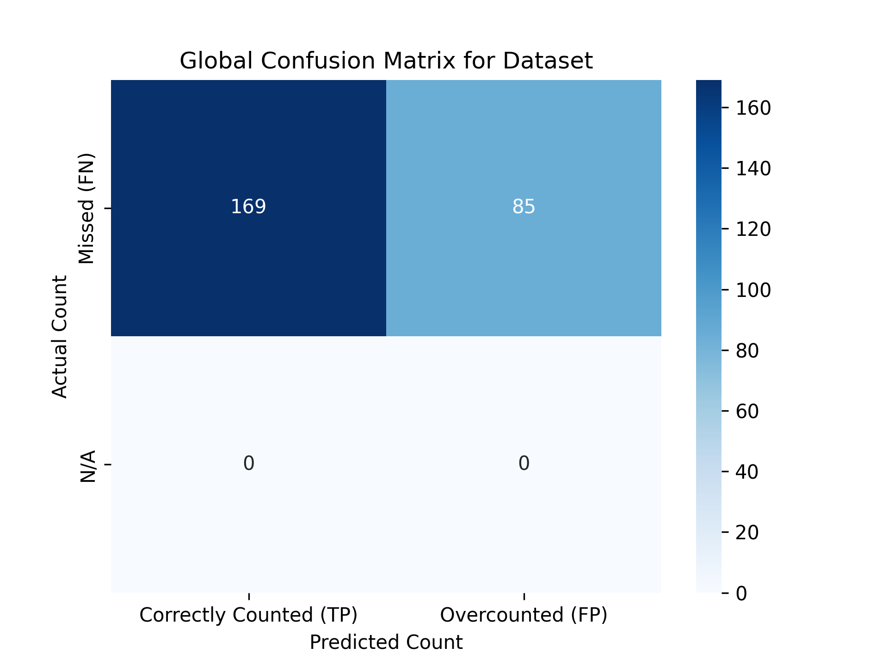
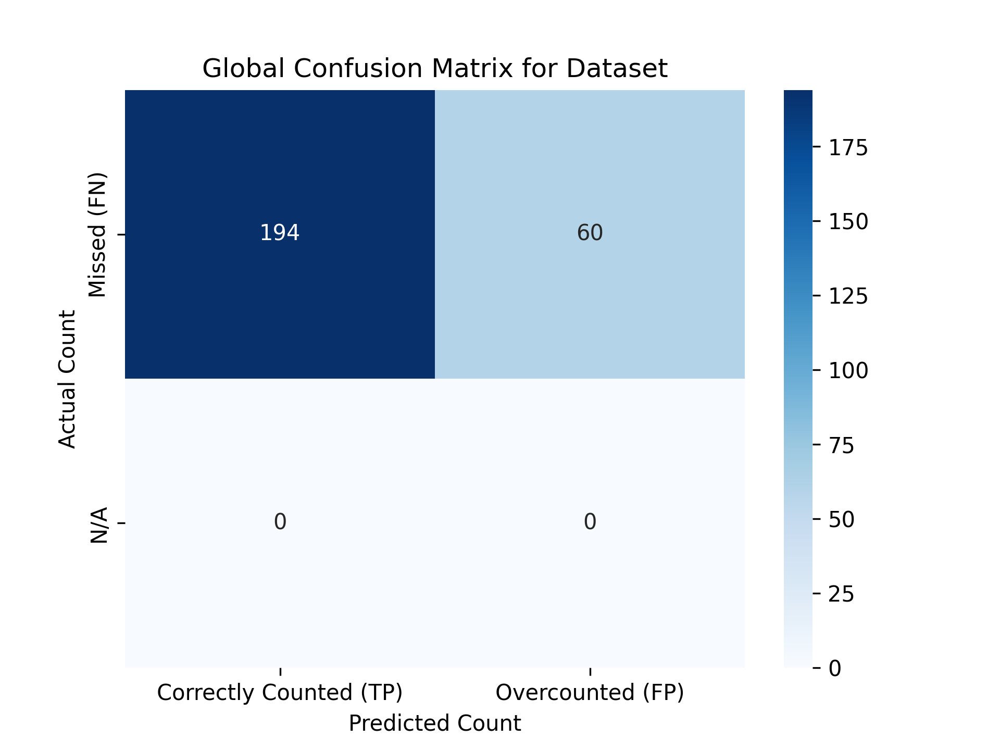

# First project
In this project we have to create a method to count the eggs in a basket with computer vision techniques.


# Requirements

- Dataset of images of baskets with eggs linked [here](https://mega.nz/file/kUFnTTgI#U6cEo6Q38IbwXabWYrVuZb7rMdtC7wfaXeD66DuWF7E)

# Overall results
We used HSV and LAB color spaces to detect the eggs in the baskets. The results are shown in the following images:

## LAB color space


```python
Precision: 0.67
Recall: 1.00
F1 Score: 0.80
Accuracy: 0.67
```

### Confusion matrix



## HSV color space

```python
Precision: 0.76
Recall: 1.00
F1 Score: 0.87
Accuracy: 0.76
```

### Confusion matrix




## Binary masks
Can be found in the `data/masks` folder.

# Next steps
- Improve the bouns used on LAB color space
